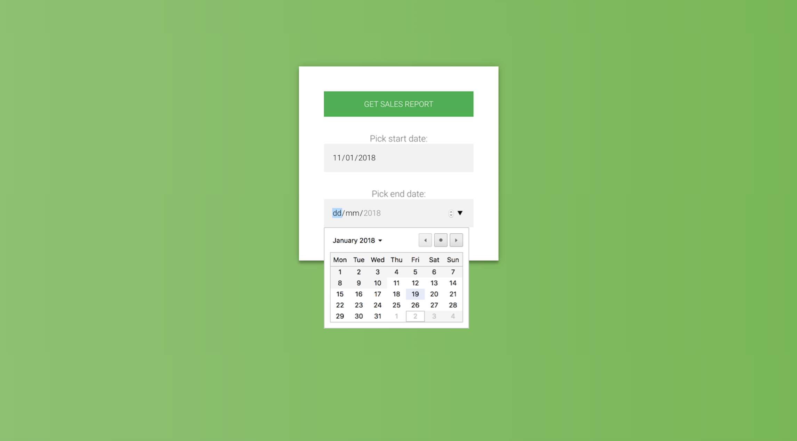
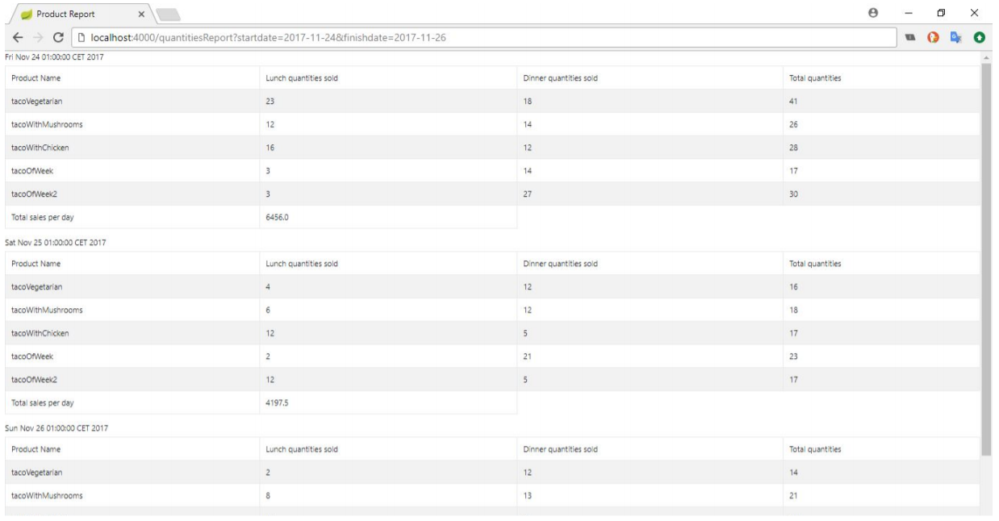

# TacosPastor-ExamProject
Sales Tracking &amp; Reporting System, 3rd semester exam project for Software Design 3 course.
### Task
Develop a system in colaboration with an organisation and document the development process. 

## Vision
A team of two developers develops an ITS that captures all transactions made by the organisation's legacy system. 
The system has a simple GUI allowing managers to request detailed sales reports. The business requirements are volatile,
so the team chose Scrum as a methodology in order to respond better to change.

## Screenshots

  
